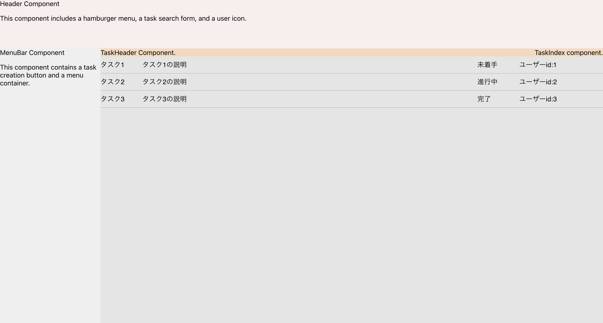
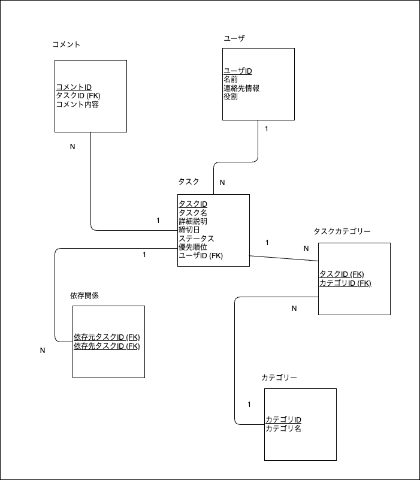

# TaskManagement
## 概要
DBを設計しAPIを介して操作を定義し、フロントエンドでUIを提供するwebシステムの基本的な構成を学習する。  
todoリストを拡張してタスク管理アプリを実装する。  
現段階ではユーザはwebブラウザからタスク一覧を閲覧することができる。

## アプリ画面イメージ


## 動作方法(Mac)
1. Docker Desktopを起動する
2. ターミナルを起動し、下記コマンドでコンテナを実行する
```
docker-compose up -d
```
3. ウェブブラウザで localhost:3000 にアクセスする
4. アプリ停止時は下記コマンドを実行する
```
docker-compose down
```

## 機能
タスクの作成、閲覧、削除

## 目的
webアプリケーション全体の開発を実践することが目的。
実用性として、自身の抱えるタスクに対する把握と整理を補助する事を目指す。

## 作業進捗
### 達成 (開発環境で実施)
- 基本的なテーブルであるtasksテーブルと、これを操作するAPIを実装した。
- UIの大まかなレイアウトを設計し、主要なラッパーコンポーネントを配置した。

### 未達成
- タスク作成機能の実装

## 課題
- タスク一覧表示機能
  - スクロールを実装
  - 条件による表示タスクの絞り込みを実装
  - タスク表示時に、タスクに紐づいたユーザIDではなくユーザ名を表示する
  - ページングの実装
- DBのテーブル追加
  - 依存関係テーブル
  - カテゴリテーブル
- 主要コンポーネントの実装
  - メニューバー
  - タスクバー

## 設計関連
### ER図

### UIデザイン
[Figmaのワイヤフレーム](https://www.figma.com/file/KLKgshqxkwzqKdocatzcuk/TaskManagement?type=design&node-id=0%3A1&mode=design&t=yIbG52c6E4qEUE8r-1)

## 使用技術
- フロントエンド: React.js
- バックエンドAPI: Rust, actix_webフレームワーク
- データベース: PostgreSQL
- 実行環境: Mac(Apple M1), docker
